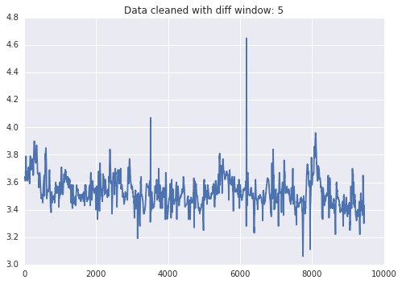
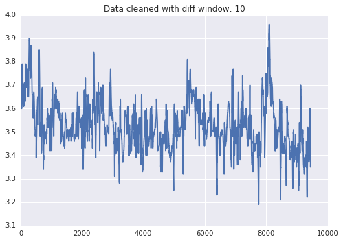

# tobii_glasses2_utils
Various utilities to record and process Tobii Glasses 2 eye-tracking data

Dependencies (that aren't automtically included in the Anaconda distribution):

**INSTALL THESE IN ORDER**

1. ffmpeg
    * Can be installed with homebrew on OS X. Just do 'brew install ffmpeg'
1. OpenCV
    * Will put together conda package of openCV that works with ffmpeg.  For now you have to build it from source.

## tobii_data_process.py

We have found that finding discontinuous points in eye tracking data is most effective when using the mean of a window around each point and comparing that value to the point itself. After some testing we decided to set the window size at 10. This value does the best job of removing discontinuous points without removing too much information, as can be seen in the examples below.

